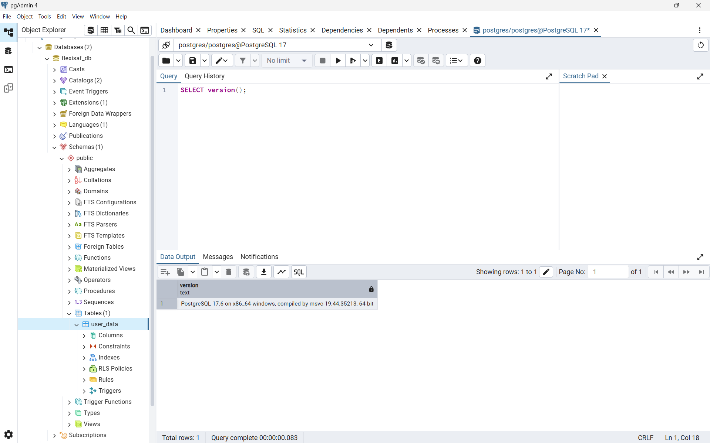

# Week 1 Task - FlexiSAF Internship

## Task: Hands-on Environment Setup
- Setup a DBMS (PostgreSQL) and DBMS admin tools
- Setup a Spring Boot application using Maven
- Connect Spring Boot to PostgreSQL
- Implement a simple "UserData" entity with CRUD operations

---

## ⚙️ Technologies Used
- **Java 21 LTS**
- **Spring Boot 3.5.5**
- **Maven** (build tool)
- **PostgreSQL 17.6**
- **Spring Data JPA**

---

## Backend
- Spring Boot application with Maven
- PostgreSQL database connection
- A simple `UserData` entity with `id`, `full_name`, `email`, `password`, `gender`, `date_of_birth`. Here I chose to name the class entity "UserData," because "user" is a reserved keyword in PostgreSQL.
- CRUD repository with Spring Data JPA

---

## 🚀 How to Run the Project

### 1️⃣ Clone the repository
Open your terminal and run:

```bash
git clone https://github.com/MuhammedBakor/FlexiSAF-Internship-MohammadBakurIbrahim.git
```

```bash
cd FlexiSAF-Internship-MohammadBakurIbrahim/Week1/backend
```
### 2️⃣ Configure PostgreSQL

- Make sure PostgreSQL is installed and running on your system.

- Create a database named flexisaf_db:

```bash
CREATE DATABASE flexisaf_db;
```

- Update your username and password inside: src/main/resources/application.yaml
  <br> datasource:
  <br> &ensp; url: jdbc:postgresql://localhost:5432/flexisaf_db
  <br> &ensp; username: postgres
  <br> &ensp; password: password
---

### 3️⃣ Build the project with Maven

- Run the following command to download dependencies and build the project:

```bash
mvn clean install
```
### 4️⃣ Run the Spring Boot application

- Start the application with:

```bash
mvn spring-boot:run
```

The server will start at:
👉 http://localhost:8080

#### - Postgres pgAdmin 4 home page screenshot with the connected "flexisaf_db" database and showing "user_data" table.


## Learning Outcome
- Learned how to setup a development environment with PostgreSQL and Spring Boot
- Learned Maven build tool usage
- Learned basic CRUD operations using Spring Data JPA

