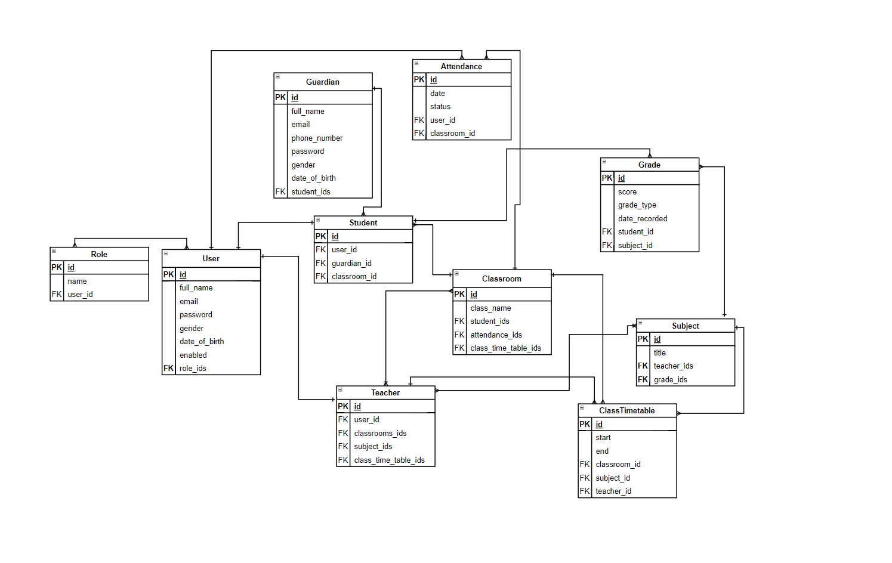
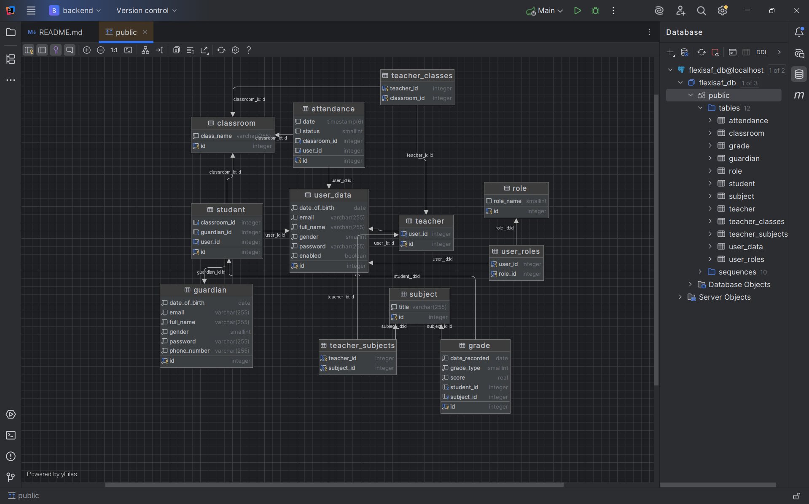

# Week 2—Database Architecture & ERD

---

## 🎯 Task
- Design a database schema for any domain of your choice 
- And produce an Entity Relationship Diagram (ERD) for the database

## 📖 Description

---

For Week 2 of the internship, I designed a database schema for a school academic management system for ten tables' relationships.   
The schema models a real-world school environment where we manage students, teachers, roles, classes, subjects, attendance, grades, and guardians.  
The purpose is to capture the key entities and their relationships in a way that supports academic operations and reporting.

---

## 🗂️ Tables/Entities

---

- User
- Role
- Student
- Guardian
- Teacher
- Classroom
- Subject
- Grade
- ClassTimetable
- Attendance

---
### Entities and Details

---
- **User**: Represents system users (teachers, administrators, or students with login access).
- **Role**: Defines user roles (e.g., ADMIN, TEACHER, STUDENT). A user can have multiple roles.
- **Student**: Stores student information, linked to a class and a guardian.
- **Guardian**: Represents parents or guardians responsible for students.
- **Teacher**: Represents instructors who teach subjects in different classes.
- **Classroom**: Groups students together, and links with timetables.
- **Subject**: Represents academic subjects taught in classes.
- **Grade**: Stores students’ performance in different subjects grade type (e.g., PROJECT, QUIZ, FINAL_EXAM).
- **ClassTimetable**: Defines when and where subjects are taught by teachers.
- **Attendance**: Tracks daily attendance of users (students or teachers) for each class.

---

### Screenshot of the Entity relationships diagram using UML:


---

## 🔗 Relationships and Justification

---
- **User ↔ Role (Many-to-Many)**: A user can have multiple roles, and roles can be assigned to multiple users.
- **User ↔ Student (One-to-One)**: Each student has only one account in the system, and this account is dedicated to one student only.
- **User ↔ Teacher (One-to-One)**: Each teacher has only one account in the system, and this account is dedicated to one teacher only.
- **User ↔ Attendance (One-to-Many)**: Each user has multiple attendance records, which were attended at a specific time.
- **Student ↔ Guardian (Many-to-One)**: Each student has one guardian, while a guardian may be responsible for many students.
- **Student ↔ Grade (One-to-Many)**: Each student gets one or more grades.
- **Student ↔ Classroom (Many-to-One)**: Each student belongs to one class, but a class has many students.
- **Teacher ↔ Classroom (Many-to-Many)**: A teacher can manage or teach in multiple classes, and the class could be taught by more than one teacher.
- **Teacher ↔ Subject (Many-to-Many)**: A teacher can manage or teach multiple subjects, and each subject can be taught by one or more teachers.
- **Teacher ↔ ClassTimetable (One-to-Many)**: A teacher has multiple timetables to teach, and each timetable is related to one teacher.
- **Classroom ↔ Attendance (One-to-Many)**: Each classroom could have more than one attendance.
- **Classroom ↔ ClassTimetable (One-to-Many)**: Each classroom could have multiple timetables, and each timetable is related to one classroom.
- **Subject ↔ Grade (One-to-Many)**: Each subject contains multiple students' grades.
- **Subject ↔ ClassTimetable (One-to-Many)**: Each subject has multiple scheduled timetables to be taught.

---

This schema ensures that academic operations such as enrolling students, assigning teachers, scheduling classes, recording attendance, and tracking grades are handled efficiently.

---

### Screenshot of the tables' relationship diagram inside the IntelliJ Ultimate IDEA DBMS:

---

## 🚀 How to Run

---
1. Clone the repository
   ```bash
   git clone https://github.com/MuhammedBakor/FlexiSAF-Internship-MohammadBakurIbrahim.git

2. Navigate to week2

   ```bash
   cd week2/backend

3. Make sure PostgreSQL is running and update application.yaml with your DB credentials.


4. Run the app

   ```bash
   mvn spring-boot:run

---
## 📚 Learning Outcome

- Learned the high-level design of a database schema with entities and relationships (ERD) and modeled as tables, keys, and constraints.

- Practiced mapping database tables to Spring Boot JPA entities.

- Strengthened knowledge in relationships: One-to-Many, Many-to-One, Many-to-Many.

- Gained experience with PostgreSQL integration in Spring Boot.

---

